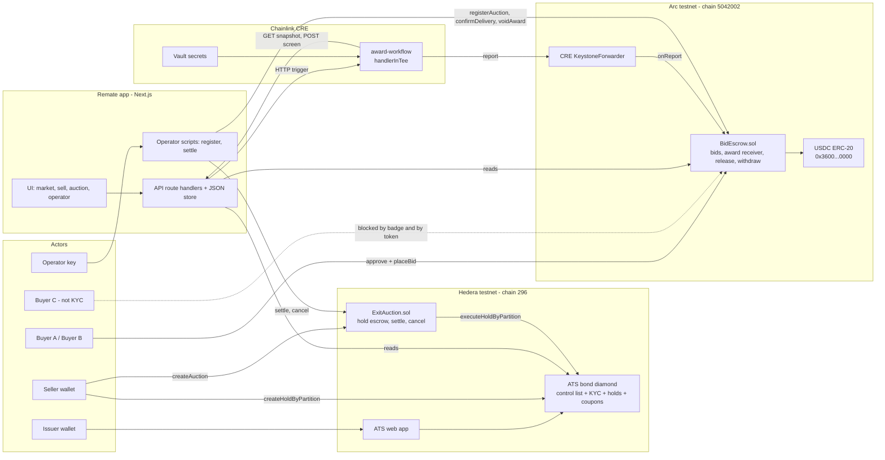
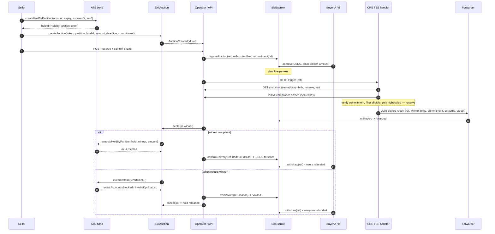
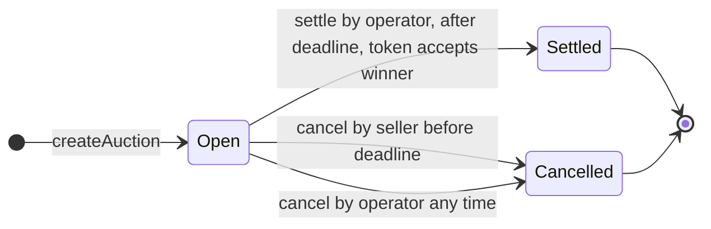
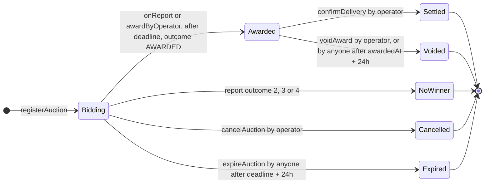

# Architecture

> PNG export of the component diagram goes to `docs/architecture.png` for the README and the
> video (mermaid.live → PNG at 2×, or redraw in Excalidraw with the same boxes).

## Summary

Remate is an exit venue for bonds issued with Hedera's Asset Tokenization Studio (ATS). The
asset and its compliance live on Hedera testnet: the bond is an ATS token with a whitelist
control list and internal KYC, and the seller lists it by placing a **hold** on their own
bonds with our `ExitAuction` contract as escrow, so nothing is transferred at listing time.
The cash leg lives on Arc testnet: buyers deposit USDC bids into `BidEscrow`. The award is
computed inside a Chainlink CRE **confidential workflow** that reads the seller's sealed
reserve price and a compliance screening through secret-authenticated HTTP calls, and writes
a DON-signed report to `BidEscrow`. Delivery is executed on Hedera by the venue operator via
`executeHoldByPartition`, where the ATS token itself enforces KYC and whitelist rules at the
moment of transfer; only then is USDC released to the seller. Settlement is coordinated across
two chains, not atomic, and this document says where the trust boundaries are.

## Component diagram

## Happy path and failure branch

## State machines

Withdrawals: never in `Bidding`; full refund in `Voided`, `Cancelled`, `Expired`, `NoWinner`;
full refund for non-winners in `Awarded` and `Settled`; the winner withdraws `bid −
clearingPrice` in `Settled` (zero with first-price clearing when the bid equals the price).

## On-chain vs off-chain

| Item | Where | Notes |
|---|---|---|
| Bond, whitelist, KYC, holds, coupons | Hedera, ATS token | Configured in the ATS web app |
| Auction registry, hold execution, cancel | Hedera, `ExitAuction` | Verified on HashScan |
| Reserve **commitment** | Hedera and Arc | `keccak256(abi.encode(reserve, salt))` |
| Reserve **value** + salt | Off-chain, backend JSON store | Read only by the TEE handler and the local fallback engine |
| Bids and escrowed USDC | Arc, `BidEscrow` | Public amounts |
| Compliance screening | Off-chain, backend endpoint | Hedera reads + a mock sanctions list; response treated as confidential |
| Award computation | Inside the CRE enclave | Only winner, price, commitment, outcome, digest leave |
| Award record | Arc, `BidEscrow` | Written by the forwarder from a DON-signed report |
| Delivery confirmation | Arc, `BidEscrow` | Operator call carrying the Hedera tx hash as a pointer |
| Auction/bid index for the UI | Backend JSON store + contract getters | No indexer |

## Trust model and the named limitation

- **The token enforces compliance, not the venue.** `executeHoldByPartition` runs the ATS
  control-list and KYC checks on the recipient. No operator action can move a bond to a
  non-compliant wallet.
- **The award is DON-attested on Arc.** `BidEscrow` accepts a report only through the
  forwarder, only for a known `ref`, only while `Bidding`, only after the deadline, only if
  the reported commitment matches the stored one, and only if the winner's escrow covers the
  price. Replays are rejected by the state machine.
- **The operator relays, it cannot redirect.** `confirmDelivery` pays only the registered
  seller; refunds go only to bidders; `voidAward`/`cancel` can grief but not steal.
  Anti-lockup timers let anyone expire or void a stale auction.
- **Settlement is coordinated, not atomic.** Hedera and Arc do not share state and Circle
  has no interop with Hedera today. The `hederaTxHash` stored on Arc is a pointer for humans
  and the UI, not a proof verified on-chain.
- **The simulator is not a hardware enclave.** Confidential Workflows are in private beta;
  the bounty accepts CLI simulation and the CLI prints a banner saying so.
- **Testnet forwarder.** The mock forwarder used in simulation accepts unsigned reports; the
  contract-level checks above still hold. Production uses the KeystoneForwarder and
  `setExpectedWorkflowId`.

## Production path

`docs/MAINNET.md` covers the Arc mainnet deployment. Beyond that: a second CRE trigger reads
the Hedera settlement through the mirror node over HTTP and writes `confirmDelivery` itself,
removing the operator from the cash release; the reserve moves from the backend store to an
encrypted blob decrypted inside the enclave; `bidsDigest` is verified on-chain so the backend
cannot hide bids from the TEE.

## Bounty mapping

| Sponsor requirement | Component | Evidence |
|---|---|---|
| Hedera: ATS used to issue or manage a tokenised asset | ATS web app, bond token | L1 runbook, video 0:20 |
| Hedera: deployed and demonstrated on testnet, verified on HashScan | `ExitAuction` | HashScan verified link |
| Hedera: issuance, configuration, lifecycle op in video | ATS app + `settle` | video 0:20, 2:20, 2:50 |
| Hedera extra: secondary market, compliance controls, coupons | whole flow | video |
| Arc: meaningful use of Arc and USDC; conditional / multi-step settlement | `BidEscrow` + USDC | ArcScan links |
| Arc: frontend + backend + architecture diagram | `apps/web`, this file | README PNG |
| Chainlink: `handlerInTee`, sensitive input, meaningful integration, simulation evidence | `award-workflow` | `docs/evidence/cre-simulate-*.log`, ArcScan `Awarded(source=CRE)` |

## Networks and fixed addresses

| Item | Value |
|---|---|
| Hedera testnet chain id | `296` |
| Hedera JSON-RPC | `https://testnet.hashio.io/api` |
| Hedera mirror node | `https://testnet.mirrornode.hedera.com/api/v1` |
| Hedera explorer | `https://hashscan.io/testnet` |
| ATS Factory (shared testnet) | `0.0.9213391` = `0xd1F118A40f3b02883D35909eF2517e7EDd78379d` |
| ATS BusinessLogicResolver | `0.0.9212226` = `0xBA2D5FC2083A0b8f164c50e65d782087fBA18E0a` |
| ATS bond config id / version | `0x…02` (bond) or `0x…03` (fixed rate), version `1` |
| Default partition | `0x0000000000000000000000000000000000000000000000000000000000000001` |
| Arc testnet chain id | `5042002` |
| Arc RPC | `https://rpc.testnet.arc.io` |
| Arc explorer | `https://testnet.arcscan.app` |
| USDC on Arc (ERC-20 interface, 6 decimals) | `0x3600000000000000000000000000000000000000` |
| Arc min base fee | 20 gwei (set `maxFeePerGas ≥ 30 gwei`) |
| CRE chain selector | `arc-testnet` |
| CRE forwarder candidates | `0x6E9EE680ef59ef64Aa8C7371279c27E496b5eDc1`, `0x76c9cf548b4179F8901cda1f8623568b58215E62` — sources disagree on which is simulation vs production; `BidEscrow.setForwarderAddress` exists and L4 records the confirmed one in `addresses.json` |
| Our contracts | see `packages/shared/src/addresses.json` |
